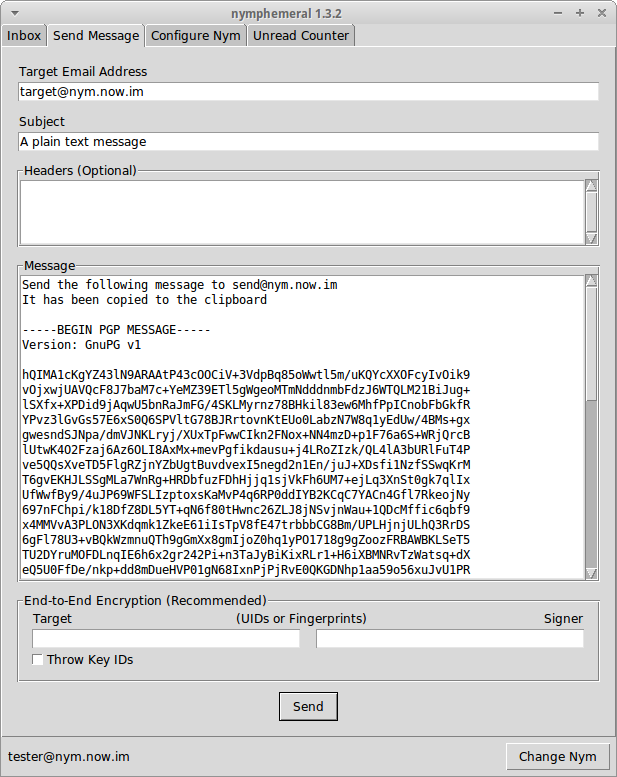
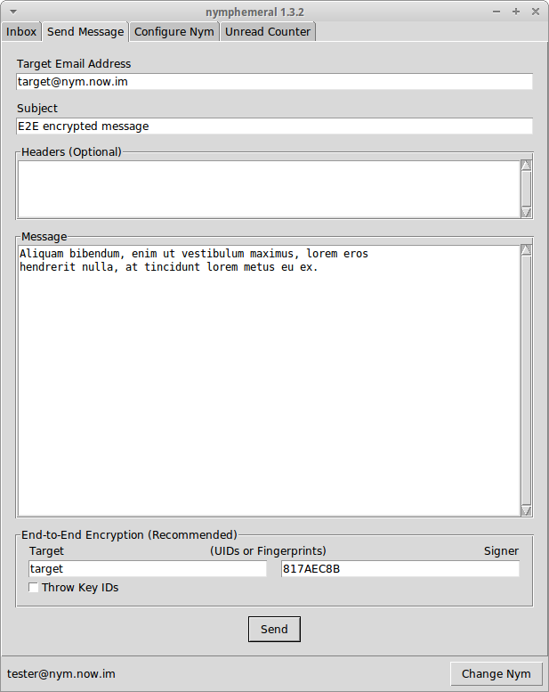

.. _composition:

================
Sending Messages
================
Sending a message is simple. Fill in the ``Target Email Address``,
``Subject`` and ``Message`` fields and click ``Send``.

.. figure:: send.png
   :scale: 50%
   :alt: Send Message Tab
   :align: left

   Send Message Tab

   Sent Message

Optional Headers
----------------
In the ``Headers`` text box, other headers can be added to the
message in the format::

    HeaderA: InformationA
    HeaderB: InformationB

Example
'''''''
I know a server that allows me to post messages to *Usenet*. I
provide its email address in the ``Target Email Address`` and as I
wish to post to *alt.privacy.anon-server*, I type the following
header in the ``Headers`` text box::

    Newsgroups: alt.privacy.anon-server

The server will process the message and the post should arrive in
the news group.

End-to-End Encryption
---------------------

   End-to-End Encryption

The ``End-to-End Encryption`` section enables the user to encrypt
and/or sign messages. The ``Target`` and ``Signer`` fields can
receive either an UID or fingerprint. If more than one key is found
for that query, nymphemeral will ask the user to be more specific, to
avoid ambiguity.

There is also the option to use the ``Throw Key IDs`` checkbox, so
that **if** someone obtains the ciphertext, they will not even be
able to find out whom the message was encrypted to, because the key
ID was removed. Therefore, when someone receives that message, they
will have to use all of their keys to attempt to decrypt it.

If the message is being signed, either the GPG Agent or nymphemeral
will prompt you for a passphrase to unlock the secret key:

.. figure:: agent.png
   :alt: GPG Agent
   :align: center

   GPG Agent

**Note:** You should read the :ref:`keyring` section to add the keys
involved in the End-to-End Encryption to nymphemeral's keyring.