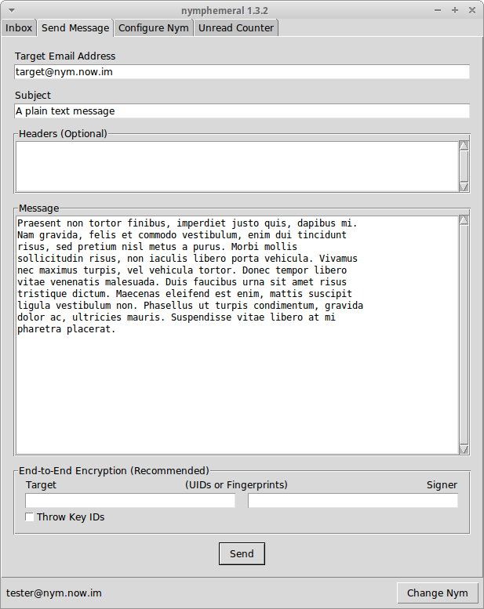
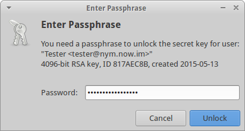

.. _composition:

================
Sending Messages
================
Sending a message is simple. Fill in the ``Target Email Address``,
``Subject`` and ``Message`` fields and click ``Send``.

   Send Message Tab

.. figure:: sent.png
   :scale: 50%
   :alt: Sent Message
   :align: right

   Sent Message

Optional Headers
----------------
In the ``Headers`` text box, other headers can be added to the
message in the format::

    HeaderA: InformationA
    HeaderB: InformationB

Example
'''''''
I know a server that allows me to post messages to *Usenet*. I
provide its email address in the ``Target Email Address`` and as I
wish to post to *alt.privacy.anon-server*, I type the following
header in the ``Headers`` text box::

    Newsgroups: alt.privacy.anon-server

The server will process the message and the post should arrive in
the news group.

End-to-End Encryption
---------------------

   End-to-End Encryption

The ``End-to-End Encryption`` section enables the user to encrypt
and/or sign messages. The ``Target`` and ``Signer`` fields can
receive either an UID or fingerprint. If more than one key is found
for that query, nymphemeral will ask the user to be more specific, to
avoid ambiguity.

There is also the option to use the ``Throw Key IDs`` checkbox, so
that **if** someone obtains the ciphertext, they will not even be
able to find out whom the message was encrypted to, because the key
ID was removed. Therefore, when someone receives that message, they
will have to use all of their keys to attempt to decrypt it.

If the message is being signed, either the GPG Agent or nymphemeral
will prompt you for a passphrase to unlock the secret key:

   GPG Agent

.. note::

    You should read the :ref:`keyring` section to add the keys
    involved in the End-to-End Encryption to nymphemeral's keyring.

Message Structure
-----------------
It is important to know how the contents of your message are handled.
For example, if you composed the following message::

    To: recipient@domain
    Subject: Foo

    Bar

It would be encrypted to the server (with both asymmetric and
ephemeral encryption layers) and would become the following
message to be transmitted::

    To: send@server

    -----BEGIN PGP MESSAGE-----
    <ciphertext>
    -----END PGP MESSAGE-----

If someone intercepted the message, they would only learn that
you sent a message to ``send@server``, which would remail it to
someone else. However, they learn nothing about the original message,
because it is encrypted to the server. Now, when the server receives
and decrypt it, the original message is accessed::

    To: recipient@domain
    Subject: Foo

    Bar

That is the reason that another layer (end-to-end encryption) should
be added. That way, when the server removes its encryption layer, it
would only have access to the headers::

    To: recipient@domain
    Subject: Foo

    -----BEGIN PGP MESSAGE-----
    <ciphertext>
    -----END PGP MESSAGE-----

It is called "end-to-end" because only the ends of the transmission
(you and the recipient) can access the data. That last encryption
layer must be removed by the recipient, to finally obtain the
plaintext of the message.  The last thing you should know is that the
headers cannot be encrypted. Therefore, make sure to use non
sensitive information for the **subject** and **optional headers**
you might add.
