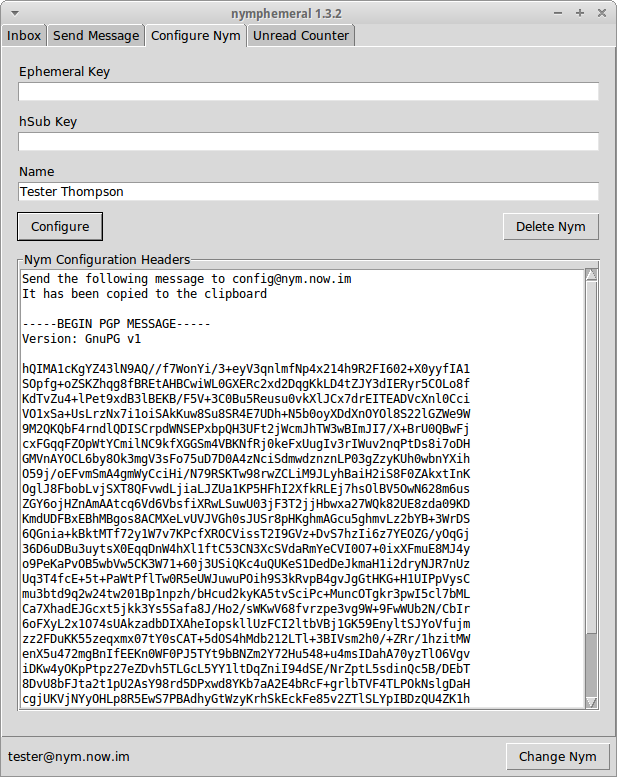

.. _sec-configuration:

===================
Configuring the Nym
===================

   Configure Nym Tab

On the ``Configure Nym`` tab you can modify the ``Pseudonymous Name``,
``Ephemeral Key`` and ``hSub key`` of your nym (both keys can be
automatically generated by nymphemeral). Clicking on ``Configure``
will create the message that will be sent to the server.  If you wish
to not use your nym anymore, click ``Delete Nym``.

.. tip::

    If you believe that the server is not processing your
    messages, try to change the ``Ephemeral Key`` so that the
    databases will be synced.
