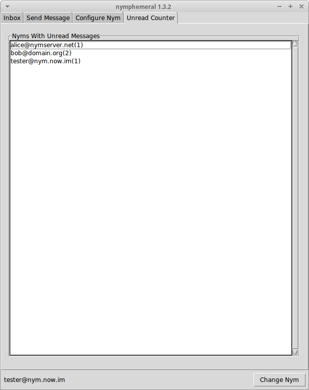

=======================
Unread Messages Counter
=======================

   Unread Counter Tab

On the ``Unread Counter`` tab there is a list of nyms with unread
messages, so you do not need to log in with all your nyms to check if
they have new messages (as long as you are retrieving messages with a
nym that has access to the encrypted hSub passphrases).
