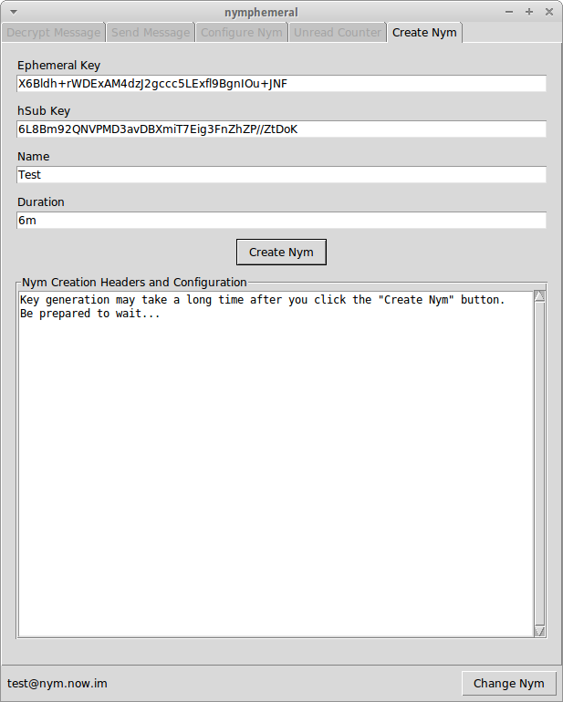
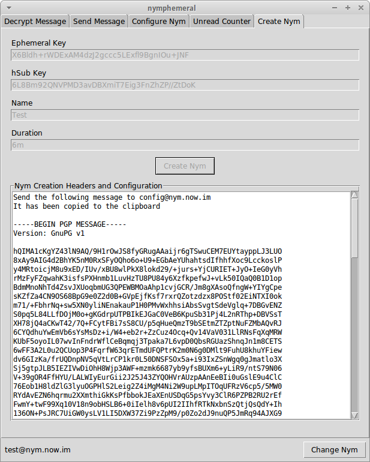

==============
Creating a Nym
==============
.. figure:: nym_not_found.png
   :scale: 70%
   :alt: Nym Not Found Dialog
   :align: right

   Nym Not Found Dialog

Back to the login window, when you click ``Start Session`` and the
nym server's public key is already in the keyring, then the client
will search for the nym address that was given. If the nym is not
found, you will be asked if you wish to create it and you will be
directed to the ``Create Nym`` tab in the main window. To create a
nym, you must provide the following information:

Pseudonymous Name
-----------------
The ``Pseudonymous Name`` field is the name you are going to give to
the nym.

Duration
--------
You must provide the duration of the nym's key. Once the key expires,
the nym expires as well. The ``Duration`` must be in the same format
used by **GPG** (e.g. ``1w``, ``2m``, or ``3y``).

Ephemeral Key
-------------
The `Axolotl Ratchet protocol`_ derives a master key from the
handshake to start a conversation. Since there is already a secure
channel between you and the server (using its PGP key), the user can
go ahead and send a master key to skip that extra step. That key is
the ``Ephemeral Key`` you need to provide. It can be any random string
since it is ephemeral and will be used only on the first round of
message exchange until the ratcheting starts.

.. tip::

    nymphemeral will automatically generate one by default, but you
    can uncheck ``Auto-generate`` and provide a key that you
    generated.

hSub Passphrase
---------------
Using a **hashed subject (hSub)** is the easiest way of setting up
subject identification for your nym to retrieve messages. An hSub is
made of two parts, where the first is a random number and the second
is the hash of that same random number and a passphrase. As the
hashing is a one-way function, no one can identify the owner of the
message. However, as you know your nym's hSub passphrase, you can
hash it with the random number of every message, and if the result
collides with the second part of the hSub, that message was sent to
your nym. More on `hSub`_ by Zax.

Saving your hSubs allows nymphemeral to retrieve messages from all
your nyms at once. You just need to know how the encryption of the
hSub passphrases file works:

The first nym that you create will encrypt its hSub passphase and can
only be decrypted by itself. The next nym to be created will save its
hSub passphrase in plaintext and will not be able to access the
encrypted file until you re-log in with the first nym. Then, it will
encrypt both passphrases to both nyms and if you create a third nym,
those two other nyms can encrypt the passphrases to the third one and
so on.

.. tip::

    nymphemeral will automatically generate one by default, but you
    can uncheck ``Auto-generate`` and provide a key that you
    generated.

.. note::

    Although the ``hSub Passphrase`` is not required to use a nym,
    this client works better if you use one and we decided to make it
    a required field. If you feel that it should allow nyms without an
    hSub, let us know.

Create Nym
----------
Finally, click ``Create Nym``. The text box will display the output
message. Read it to see if the message was sent successfully. The nym
will be created and the other tabs will be enabled.

   Create Nym Tab

   Creation Message

.. _`axolotl ratchet protocol`: https://github.com/trevp/axolotl/wiki
.. _`hsub`: http://is-not-my.name/hsub.html
