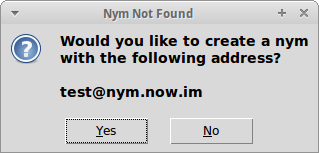
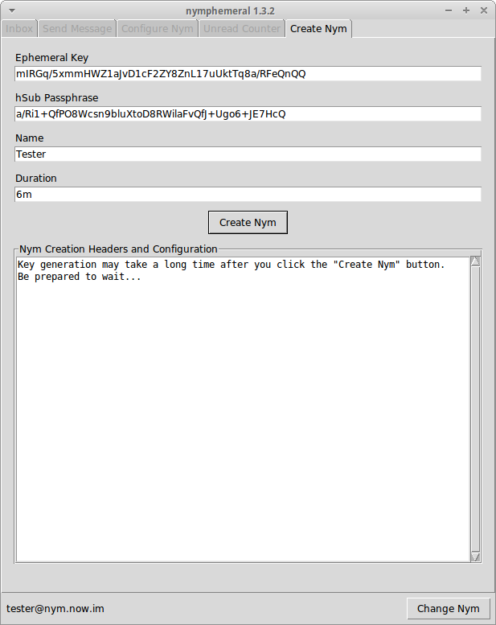
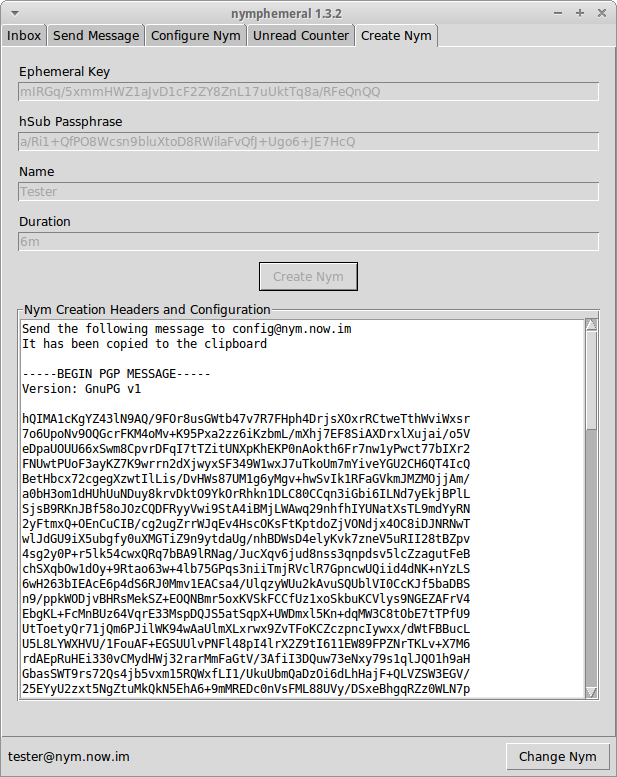

==============
Creating a Nym
==============

   Nym Not Found Dialog

Back to the login window, when you click ``Start Session`` and the
nymserver's public key is already in the keyring, then the client
will search for the nym address that was given. If the nym is not
found, you will be asked if you wish to create it and you will be
directed to the ``Create Nym`` tab in the main window.

To create a nym, fill in the ``Ephemeral Key``, ``hSub Key``,
``Name`` and ``Duration`` (e.g. ``1w``, ``2m``, or ``3y``). Finally,
click ``Create Nym``. The text box will display the output message.
Read it to see if the message was sent successfully. The nym will be
created and the other tabs will be enabled.

   Create Nym Tab

   Creation Message

hSub Passphrases
----------------
The first nym that you create will encrypt its hSub passphase and can
only be decrypted by itself. The next nym to be created will save its
hSub passphrase in plaintext and will not be able to access the
encrypted file until you re-log in with the first nym. Then, it will
encrypt both passphrases to both nyms and if you create a third nym,
those two other nyms can encrypt the passphrases to the third one and
so on.

**Note:** Although the **hSub key** is not required to use a nym,
this client works better if you use one and we decided to make it a
required field. If you feel that it should allow nyms without an
hSub, let us know.
