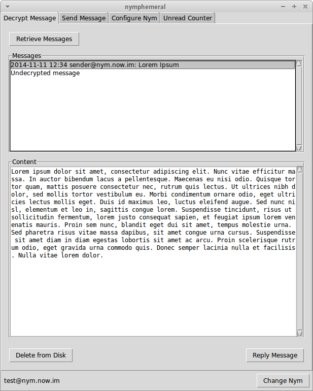

===================
Decrypting Messages
===================

   Decrypt Message Tab

After the nym is created, go to the ``Decrypt Message`` tab. There
you can click ``Retrieve Messages`` to start **aampy** and if there
are messages sent to you that are tied to your hSub key, they will be
displayed in the ``Messages`` list box. Clicking on one of the
messages will decrypt it and display it in the ``Content`` text box.
If you wish to keep the message, click ``Save to Disk``. You can also
click ``Reply Message`` and you will be directed to the
``Send Message`` tab.

**Note:** Clicking on undecrypted messages will delete them when the
process is done. If it fails to decrypt then it is useless. If it
succeeds, then it becomes useless due to the `Axolotl ratchet
protocol`_. You can go to `pyaxo`_ to read more about it.

.. _`axolotl ratchet protocol`: https://github.com/trevp/axolotl/wiki
.. _`pyaxo`: https://github.com/rxcomm/pyaxo
