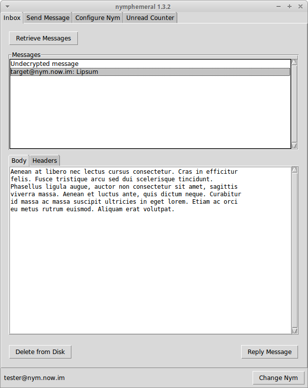
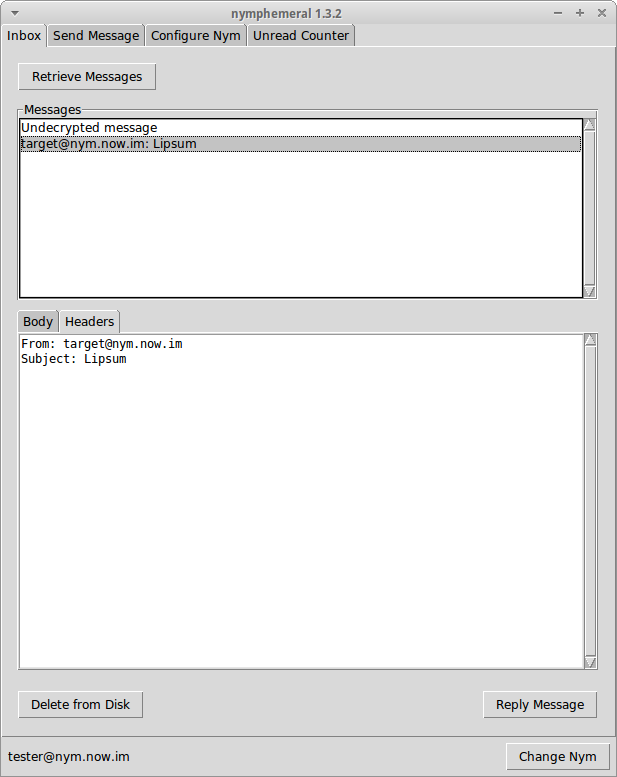
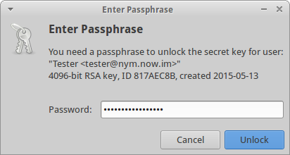

.. _decryption:

===================
Decrypting Messages
===================
After the nym is created, go to the ``Inbox`` tab. There you can
click ``Retrieve Messages`` to start **aampy** and if there are
messages sent to you that are tied to your hSub key, they will be
displayed in the ``Messages`` list box. Clicking on one of the
messages will decrypt it and display it in the ``Body`` tab and its
headers in the ``Headers`` tab. If you wish to keep the message,
click ``Save to Disk``. You can also click ``Reply Message`` and you
will be directed to the ``Send Message`` tab.

.. note::

    Clicking on undecrypted messages will delete them when the
    process is done. If it fails to decrypt then it is useless. If it
    succeeds, then it becomes useless due to the `Axolotl ratchet
    protocol`_. You can go to `pyaxo`_ to read more about it.

   Body Tab

   Headers Tab

End-to-End Encryption
---------------------
If someone has sent you an End-to-End Encrypted message, when you
click on the message to decrypt it, after removing the encryption
layers that were added by the nym server, either the GPG Agent or
nymphemeral will prompt you for a passphrase if the key is found in
the keyring:

   GPG Agent

If the key is not found or the authentication fails, the ciphertext
will be displayed, allowing you to decrypt it manually.

.. note::

    You should read the :ref:`keyring` section to add the keys
    involved in the End-to-End Encryption to nymphemeral's keyring.

.. _`axolotl ratchet protocol`: https://github.com/trevp/axolotl/wiki
.. _`pyaxo`: https://github.com/rxcomm/pyaxo
