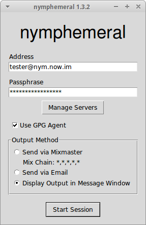
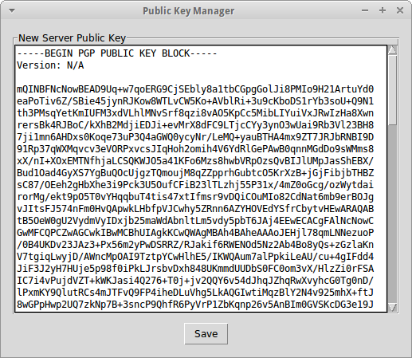
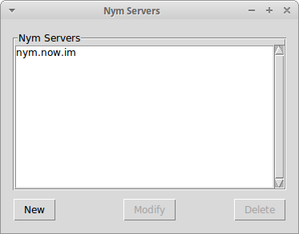

=====================
Launching nymphemeral
=====================

   Login Window

The client is launched with::

    nymphemeral

First Time Use
--------------
When you launch nymphemeral for the first time, you must import a
server public key in order to create and use nyms.

.. _sec-managing-servers:

Managing Servers
----------------
You can import the :ref:`sec-default-keys` as well as add, modify or
delete any server public key whenever you want by clicking ``Manage
Servers`` in the login window.

Starting Session
----------------
To start a session, in the login window, fill in the ``Address`` and
``Passhphrase`` fields, choose the output method that you would like
to use and click ``Start Session``. If you wish to create a nym,
you can follow the same steps - nymphemeral asks if a nym is being
created when the address is not found in the keyring.

GPG Agent
---------
If it is enabled, the GPG Agent's dialogs will be displayed when you
need to sign/decrypt messages, prompting you for a passphrase. If you
decide not to enable it, nymphemeral's own dialogs will be used.

Output Method
-------------
When **Mixmaster** is installed and configured, clicking the
``Send via Mixmaster`` radio button on the login screen will route
all messages to the nymserv through the Mixmaster network
automatically.

If you have **sendmail** configured and running on your machine, you
can also choose to send messages to the nymserv as regular email via
the ``Send via Email`` radio button automatically.

If you would rather send messages manually, select the
``Display Output in Message Window`` radio button and then copy the
encrypted message from the message window for transmission. If you
choose this option it is your responsibility to send the encrypted
message to the server. When this last method is being used, the
client assumes that the message will get to the server. Therefore,
when you finish the creation process, the nym information will be
written to disk right away as well as it will be deleted when you
confirm to delete the nym.

.. important::

    Regardless the method that is being used, information about the
    message that has just been created is displayed in the first
    lines of the text box from the current tab.

   Key Manager Window

   Server Manager Window
